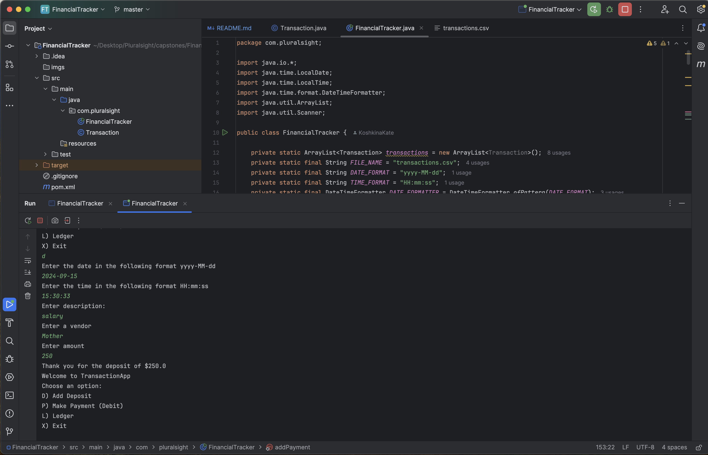
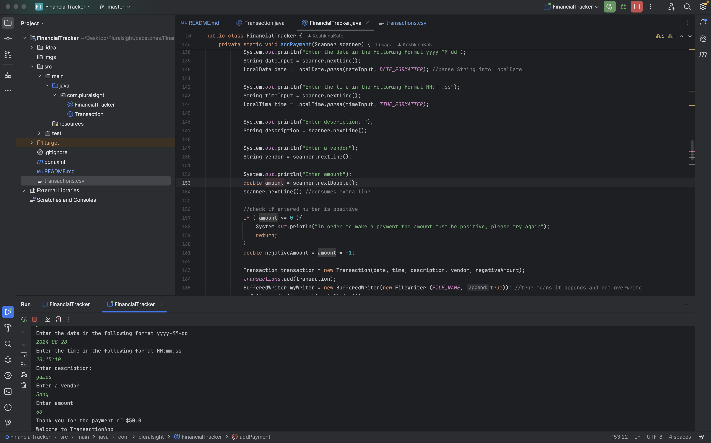
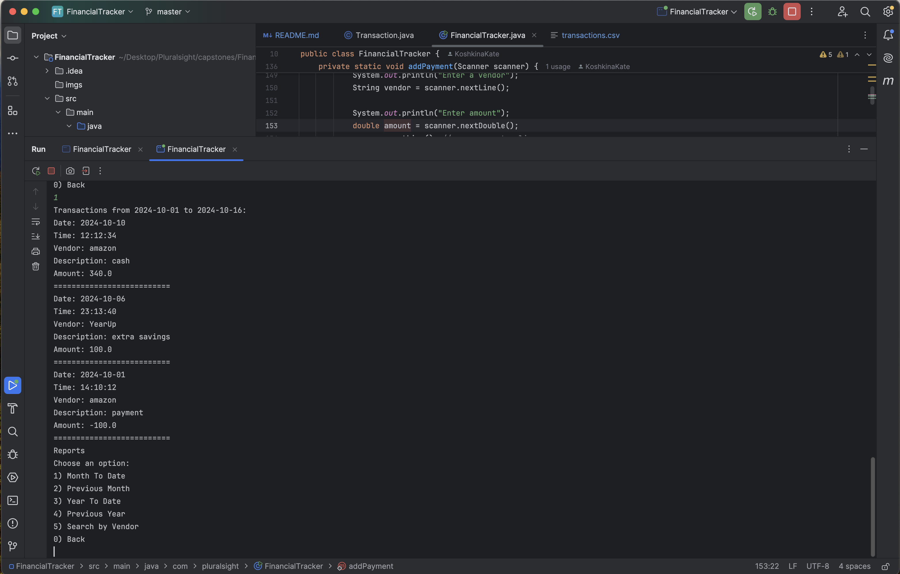
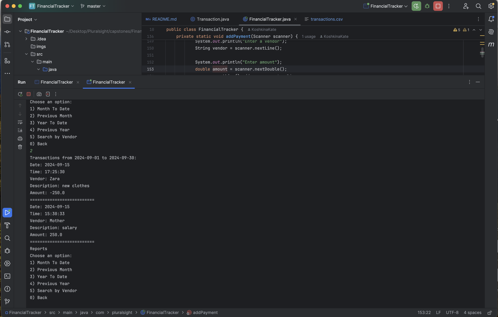
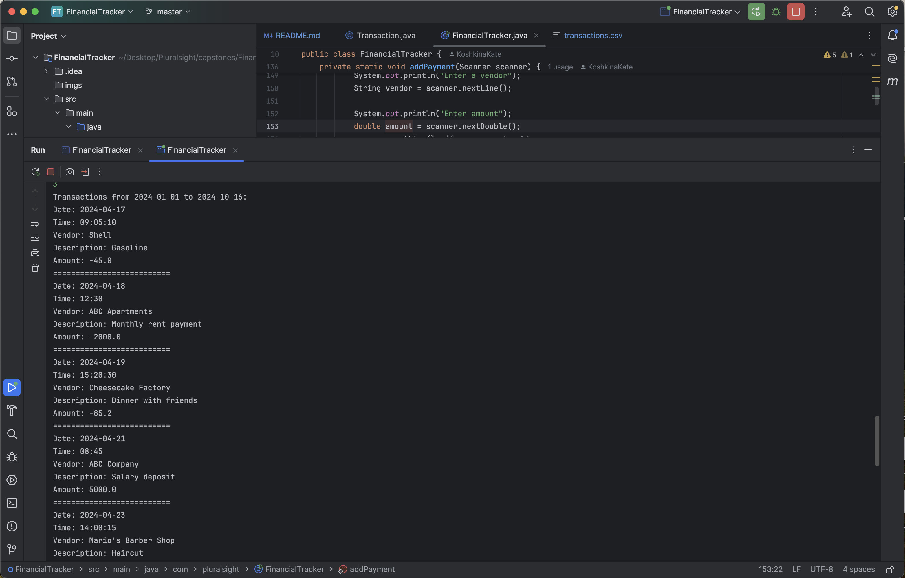
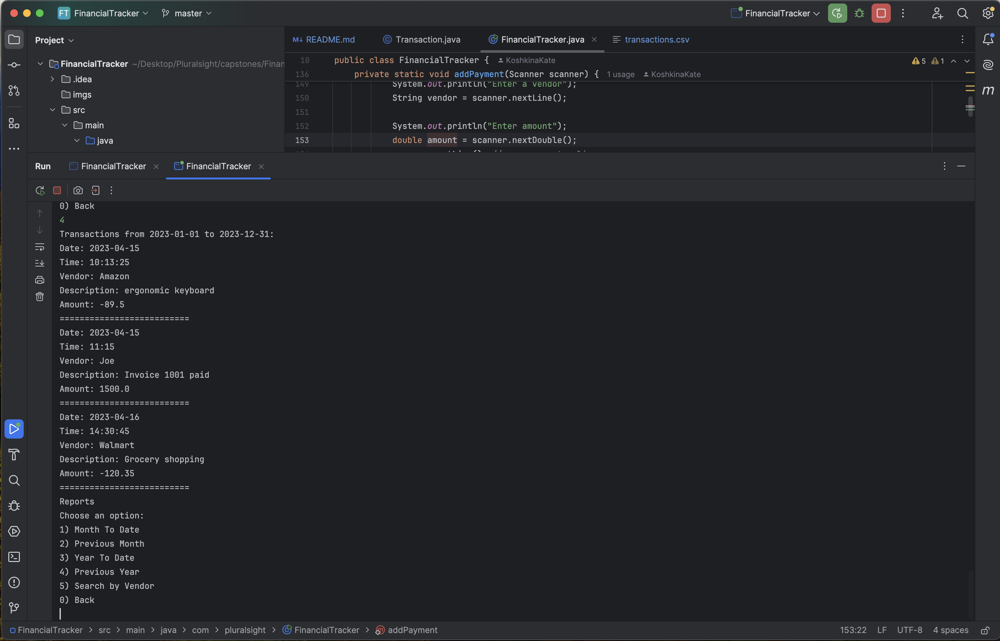
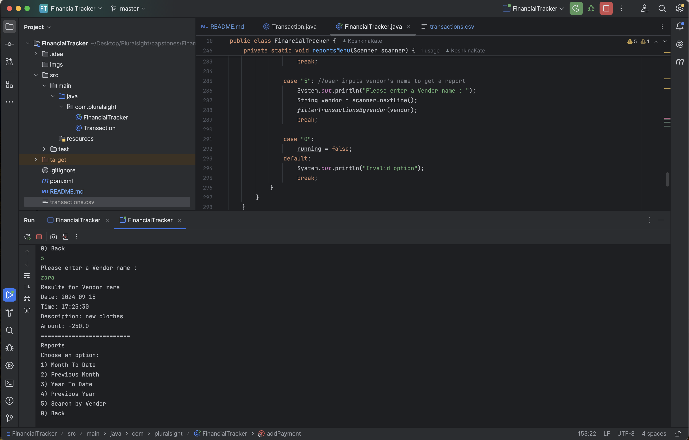

# Financial Tracker

## Description of the Project

The **Financial Tracker** application allows users to record their financial transactions, store them in a file (CSV format), and view various reports on those transactions. The application handles both deposits (positive transactions) and payments (negative transactions), and provides persistent storage for these records.

### Main Functionality:
- **Add Deposits**: Users can enter new deposits with details such as date, time, vendor, description, and amount.
- **Add Payments**: Users can log payments (debits), and the system ensures the amount is stored as a negative value.
- **Ledger**: Users can view a ledger that lists all transactions or filter to view only deposits or payments.
- **Reports**: Users can generate reports for specific time periods, such as:
    - Month-to-date
    - Previous month
    - Year-to-date
    - Previous year
    - Filter transactions by vendor
- **Persistence**: The application saves all transactions to a CSV file so that they are persistent across program runs.

## User Stories

The user stories that guided the development of this application are listed below:

- As a user, I want to be able to input my data, so that the application can process it accordingly.
- As a user, I want to generate reports based on my transactions, so that I can analyze my spending and deposits.
- As a user, I want the ability to view transactions by a specific vendor, so that I can track my dealings with them.

## Setup

Instructions on how to set up and run the project using IntelliJ IDEA.

### Prerequisites

- **IntelliJ IDEA**: Ensure you have IntelliJ IDEA installed, which you can download from [here](https://www.jetbrains.com/idea/download/).
- **Java JDK 17**: Make sure Java JDK 17 is installed and configured in IntelliJ.

### Running the Application in IntelliJ

Follow these steps to get your application running within IntelliJ IDEA:

1. Open **IntelliJ IDEA**.
2. Select "Open" and navigate to the directory where you cloned or downloaded the project.
3. After the project opens, wait for IntelliJ to index the files and set up the project.
4. Locate the main class that contains the `public static void main(String[] args)` method.
5. Right-click on the file and select 'Run 'YourMainClassName.main()'' to start the application.

## Technologies Used

- **Java**: Version 17 (or whichever version you are using).
- **File I/O**: To save transactions to a CSV file and load them back on application startup.

## Demo

Here are some screenshots that showcase the functionality of the application:

**Deposit Functionality:**

**Payment Functionality:**

**Loading All Transactions:**

**Payment and Deposit Transactions:**

**Month to Date Transactions:**

**Previous Month Transactions:**

**Current Year Transactions:**

**Previous Year Transactions:**

**Vendor Search:**

## Future Work

Potential future enhancements or functionalities that could be added to the Financial Tracker include:

- **Expense Categorization**: Add categories to transactions to allow users to track their spending in specific areas (e.g., food, rent, utilities).

## Resources

Here are some resources that were useful during the development of this project:

- Brightspace 

## Thanks

- **Raymond**: For his continuous support and guidance throughout the project.
- **Emre and Douglas**: For their dedication, teamwork, and collaboration during the project development process.
